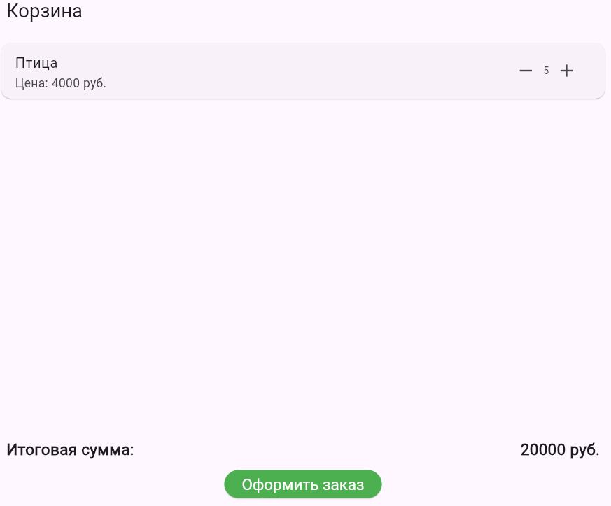

# Лушков Глеб ЭФБО-02-22

# Практическая работа 13

# Добавление таблицы users в БД 

# Добавление таблицы корзины в БД 

# Добавление таблицы заказов В БД 

# Кнопка перехода на страницу заказов в профиле 

# Заказы, совершенные на аккаунте 

# Корзина с готовым заказом 

# Совершение заказа 

# Заказ сохранен на аккаунт 

